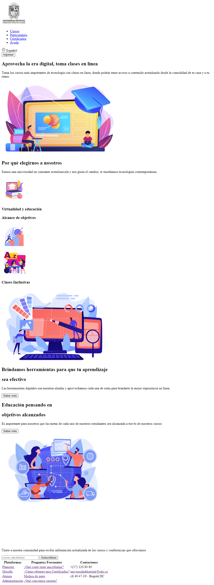

<h1>Taller 9 Leidy Johanna León Diaz</h1>

<h2> Información</h2>

Curso: full Stack Basico - Grupo 1

Profesor: Cristian Patiño

<h2> Punto 1: Link figma</h2>

<a href="https://www.figma.com/file/hFiHNyRme9iugBotoEkFFI/Leidy-Johanna-Le%C3%B3n-Diaz?type=design&node-id=5%3A2&mode=design&t=37xtZmmUc0ojLLzs-1" target="_blank">Link de Figma</a>

<h2>Punto 2: HTML</h2>

<h2>Punto 3: CSS</h2>

<h2>Punto 4</h2>

<h2>Punto 5</h2>

<h2>Punto 6</h2>

<h2>Punto 7-8</h2>

<h2>Punto 9</h2>
